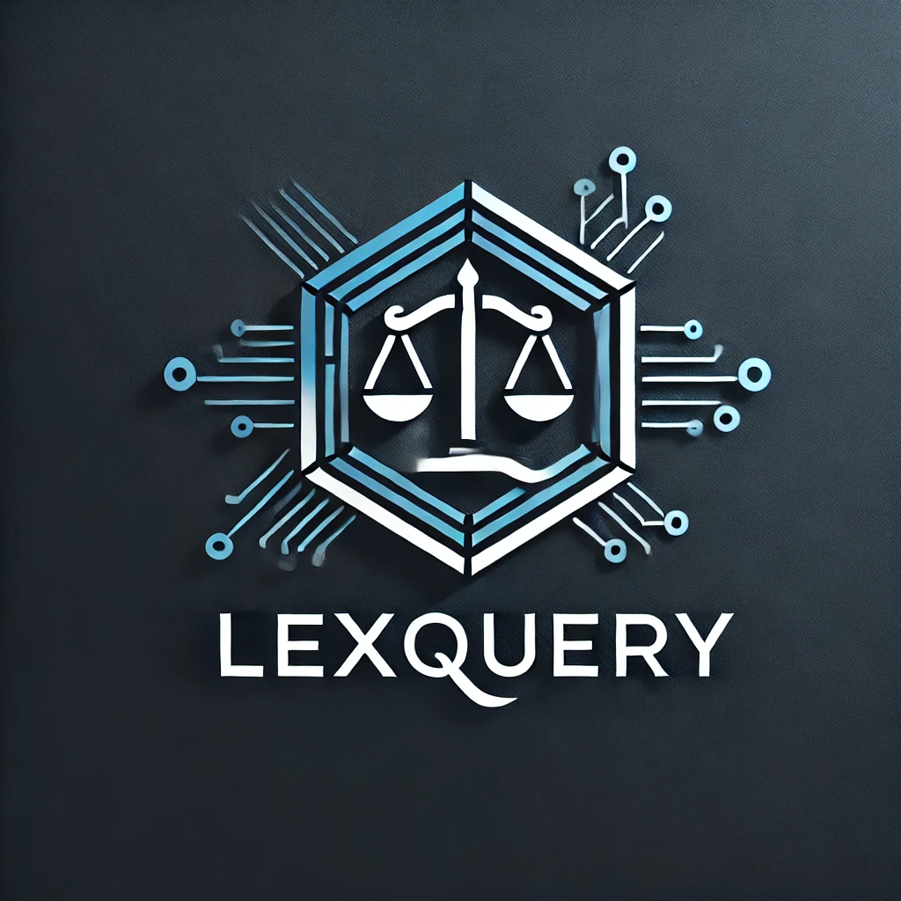

# LexQuery: Legal QA RAG Built for Scalability


## **Overview**

**LexQuery** is an **end-to-end solution** designed to handle the entire lifecycle of legal question answering, from **processing complex legal documents** to deploying an API-ready **chatbot interface**. Built with scalability and modularity in mind, LexQuery streamlines the journey from raw legal text to actionable insights, leveraging a robust architecture tailored for production.

### **What Sets LexQuery Apart?**
- **End-to-End Pipeline**: Seamlessly integrates document ingestion, vector embedding, and API delivery for real-time question answering.
- **Custom Data Storage**: Optimized for handling large-scale, domain-specific datasets, ensuring high performance and cost efficiency.
- **Scalable Deployment**: Fully deployed on AWS, leveraging serverless technologies and microservices for maximum reliability and flexibility.
- **API-Ready Accessibility**: Offers a well-designed API endpoint, enabling developers to integrate LexQuery’s capabilities directly into their applications.

Whether you’re dealing with thousands of legal documents or delivering answers to users in real time, LexQuery ensures precision, performance, and scalability—all in a single, easy-to-deploy package.



## Table of Contents
1. [Overview](#overview)
2. [Why LexQuery?](#why-lexquery)
3. [Features](#features)
4. [Project Structure](#project-structure)
5. [Getting Started](#getting-started)
6. [Usage](#usage)
7. [Deployment Instructions](#deployment-instructions)
8. [Contributing](#contributing)

### **Why LexQuery?**

This project addresses one of the most overlooked but critical challenges in the world of Retrieval-Augmented Generation (RAG): implementing a robust RAG pipeline for **non-English languages**, specifically tailored to the complexities of **Vietnamese legal texts**, in a **production environment**. Here's why this project deserves your attention out of the thousands of prebuilt RAG solutions available:

---

### **Localized Support for Vietnamese Context**
- **Beyond Prebuilt Solutions:** While prebuilt RAG packages excel in general-purpose use cases, they fall short when handling non-English languages like Vietnamese. The unique structure, grammar, and terminology of Vietnamese legal documents demand specialized preprocessing and language model fine-tuning.
- **Domain-Specific Expertise:** LexQuery is built specifically for the **Vietnamese legal domain**, focusing on handling long legal documents, forms, and regulations with precision. This focus ensures that responses are not just linguistically accurate but also legally relevant.

---

### **Designed for Production Challenges**
- **Real-World Constraints:** Many existing solutions work well in theory but struggle when scaled to production. LexQuery’s modular design directly addresses the challenges of scaling a RAG system in a resource-constrained environment while maintaining high performance and accuracy.
- **Localized Data Ecosystem:** By integrating with cost-effective and privacy-conscious infrastructure, LexQuery ensures that legal professionals and SMEs in Vietnam can rely on a dependable system tailored to their needs.

---

### **Innovative Technical Design**
1. **Custom Preprocessing for Vietnamese Texts:**
   - Handles unique grammatical constructs and tones to ensure high-quality embeddings.
   - Optimized for the nested and citation-heavy structure of Vietnamese legal documents.

2. **Advanced Retrieval Mechanisms:**
   - Employs Qdrant as a vector database for accurate and fast retrieval.
   - Fine-tuned models bridge the gap between global LLMs and local language nuances.

3. **Seamless Integration of LLMs:**
   - Supports multiple providers, including on-premise options, to ensure flexibility in deployment.

---

### **Cost-Effective and Scalable**
- **Built for SMEs and Startups:** LexQuery is optimized for low operational costs, leveraging **AWS Free Tier** services and local processing capabilities.
- **Privacy First:** Offers local inference options, which are critical for handling sensitive legal data securely.

---

### **LexQuery in Action**
Unlike generic RAG solutions, LexQuery is built from the ground up to address:
1. **Language-Specific Barriers:** High-quality Vietnamese embeddings and structured data handling for legal texts.
2. **Economic Scalability:** Deployable on cost-effective infrastructure without sacrificing accuracy or speed.
3. **Real-World Usability:** Provides legal professionals with precise, domain-specific answers, reducing manual workload and improving decision-making.

---

### **Why It Matters**


LexQuery isn’t about reinventing RAG technology—it’s about adapting proven designs, like those found in frameworks such as LangChain, to meet the **specific, underserved needs of startups** working with **Vietnamese legal content**. By focusing on the **niche challenges** of **linguistic complexity**, **document scalability**, and **cost-effective deployment**, LexQuery bridges the gap between general-purpose RAG systems and the practical requirements of SMEs.

This project is built for those who need a robust, scalable pipeline to handle **localized legal documents** with minimal overhead. LexQuery’s approach provides a tailored solution for businesses navigating the complexities of integrating modern AI into their workflows—without the need for extensive customization or massive budgets.

## Project Structure

```
legal_qa_rag/
    |- format_service/           # Handles formatting raw text into structured Record objects
    |- rag_service/              # Processes user queries using Retrieval-Augmented Generation
    |- shared_libs/              # Contains shared utilities, models, prompts, and configurations
    |- rag-cdk/                  # AWS infrastructure definitions for deployment using AWS CDK
    |- Dockerfile                # Base Docker setup for the services
    |- docker-compose.yml        # Config to run multiple services during development
    |- README.md                 # Project overview and instructions
```


## **Main Components**

- **Format Service:**
  - **Functionality:** Preprocesses raw legal text into structured chunks and stores them in a database.
  - **Capabilities:** Handles text in various forms (raw, structured, or semi-structured), ensuring that data is optimized for efficient retrieval and embedding creation.

- **Embedding Service:**
  - **Functionality:** Handles a singular endpoint for converting text into vector embeddings and coordinates with the embedding server for efficient RAG retrieval.
  - **Capabilities:** 
    - Modular design supports multiple embedding methods, including:
      - **API-based services**: AWS Bedrock, OpenAI.
      - **Local embedding models**: FastEmbed, SentenceTransformer.
    - Allows customizable embedding models to suit domain-specific needs.
  - **Special Feature:** Its modularity ensures flexibility to integrate new embedding solutions without disrupting the core pipeline.

- **RAG Service:**
  - **Functionality:** Utilizes Retrieval-Augmented Generation to answer user queries by combining document retrieval and LLM-based generation.
  - **Deployment:** Deployed as microservices using AWS Lambda, ensuring scalability and low latency.

- **Shared Libraries:**
  - **Purpose:** Provides shared components and utilities such as configuration loaders, LLM provider management, embedding creation tools, and prompting templates.
  - **Benefits:** Enhances reusability across services and reduces redundancy, streamlining development and maintenance.


## Features

- **Flexible LLM Providers:**
  - **Support for Multiple Providers:** Integrates with various LLM backends like OpenAI, Gemini, and Groq.
  - **Local LLM Integration:** Offers compatibility with local LLMs for on-premises inference, enhancing privacy and reducing reliance on external services.
  - **Easy Upgradability:** Modular design allows for straightforward addition or replacement of LLM providers as needed.

- **Microservice Architecture:**
  - **Separation of Concerns:** Each service handles distinct responsibilities, promoting maintainability and scalability.
  - **Independent Deployment:** Services can be deployed, updated, and scaled independently, ensuring flexibility in operations.

- **Embedding and Search:**
  - **FastEmbed Integration:** Utilizes FastEmbed for efficient embedding creation of legal texts.
  - **Qdrant for Retrieval:** Employs Qdrant as the vector search engine for rapid and accurate document retrieval based on embeddings.

- **AWS Integration:**
  - **Infrastructure as Code:** Uses AWS CDK for defining and managing cloud infrastructure, ensuring reproducibility and version control.
  - **Serverless Deployment:** Leverages AWS Lambda for deploying services, reducing operational overhead and costs.
  - **DynamoDB for Caching:** Implements DynamoDB for caching responses, enhancing performance and reducing latency.

- **Cost-Efficient Operations:**
  - **Optimized for AWS Free Tier:** Most services are designed to operate within the AWS Free Tier limits, making it affordable for microbusinesses to deploy and run the system.
  - **Low Operational Overhead:** Serverless architecture minimizes maintenance costs and resource usage, ensuring that operational expenses remain low.

- **API Compatibility:**
  - **HTTP and WebSocket Support:** Provides both HTTP and WebSocket APIs, enabling integration with a variety of front-end frameworks and real-time applications.
  - **Versatile Connectivity:** Facilitates connections with different front-end services, catering to diverse application requirements and user experiences.

- **Optimized Data Formatting:**
  - **Legal QA Focused:** Includes a data formatter tailored for legal question answering, emphasizing the processing of FAQs, legal documents, and citation sources.
  - **Enhanced Response Quality:** Structured data formatting ensures that embeddings and retrieval processes yield accurate and contextually relevant responses.

## Getting Started

### Prerequisites

- **AWS Account:** Ensure you have an AWS account with the necessary permissions to deploy services and infrastructure.
- **AWS CLI:** Installed and configured with your AWS credentials.
- **Docker:** Installed for containerization and local development.
- **AWS CDK:** Installed for infrastructure deployment.
- **Python 3.8+:** Required for running the services and scripts.

### Installation

1. **Clone the Repository:**

   ```bash
   git clone https://github.com/phuocnguyen90/legal_qa_rag.git
   cd legal_qa_rag
   ```

2. **Set Up Environment Variables:**

   Create a `.env` file or set environment variables directly. Essential variables include:

   - `AWS_REGION`: AWS region (e.g., `us-east-1`)
   - `CACHE_TABLE_NAME`: DynamoDB table name for caching
   - `SQS_QUEUE_URL`: URL of the SQS queue for processing queries
   - `WORKER_LAMBDA_NAME`: Name of the worker Lambda function


3. **Install Dependencies:**

   ```bash
   pip install -r requirements.txt
   ```

4. **Build and Run Services Locally (Development Mode):**

   Use Docker Compose to run multiple services during development.

   ```bash
   docker-compose up --build
   ```

### Deployment

1. **Deploy AWS Infrastructure Using CDK:**

   Navigate to the `rag-cdk-infra/` directory and deploy the infrastructure.

   ```bash
   cd rag-cdk-infra
   cdk deploy
   ```

2. **Deploy Services:**

   Services are containerized using Docker and can be deployed to AWS Lambda or ECS as per your requirements.

### Usage

1. **Submit a Query:**

   Send a `POST` request to `/submit_query` with `query_text` in the request body.

   ```json
   {
       "query_text": "What is the process for registering a business in Vietnam?"
   }
   ```

2. **Fetch Query Result:**

   Send a `GET` request to `/get_query` with `query_id` as a query parameter.

   ```bash
   GET /get_query?query_id=<your-query-id>
   ```

3. **Local Testing:**

   Use the `/local_test_submit_query` endpoint to test the RAG functionality locally without relying on worker Lambdas.

   ```json
   {
       "query_text": "What are the legal requirements for starting a business?"
   }
   ```

## Deployment Instructions

### AWS Infrastructure Setup

1. **Configure AWS CLI:**

   Ensure that the AWS CLI is installed and configured with your AWS credentials.

   ```bash
   aws configure
   ```

2. **Navigate to Infrastructure Directory:**

   ```bash
   cd rag-cdk-infra
   ```

3. **Bootstrap AWS CDK (If Not Already Bootstrapped):**

   ```bash
   cdk bootstrap
   ```

4. **Deploy Infrastructure:**

   ```bash
   cdk deploy
   ```

### DynamoDB Table Configuration

Ensure that the DynamoDB table (`CACHE_TABLE_NAME`) is set up with the following schema:

- **Primary Key:** `query_id` (String)
- **Global Secondary Index (GSI):** `cache_key-index` on `cache_key` (String)

### SQS Queue Setup

Ensure that the SQS queue (`SQS_QUEUE_URL`) is created and properly configured to receive messages for query processing.

### Lambda Function Deployment

Deploy the worker Lambda function (`WORKER_LAMBDA_NAME`) which will process the queries from the SQS queue.

## Contributing

Contributions are welcome! Please follow these steps to contribute:

1. **Fork the Repository:**

   Click the "Fork" button at the top right of the repository page.

2. **Create a New Branch:**

   ```bash
   git checkout -b feature/YourFeatureName
   ```

3. **Make Your Changes:**

   Implement your feature or bug fix.

4. **Commit Your Changes:**

   ```bash
   git commit -m "Add your descriptive commit message"
   ```

5. **Push to Your Fork:**

   ```bash
   git push origin feature/YourFeatureName
   ```

6. **Create a Pull Request:**

   Navigate to the original repository and create a pull request from your fork.

## License

This project is licensed under the [MIT License](LICENSE).

